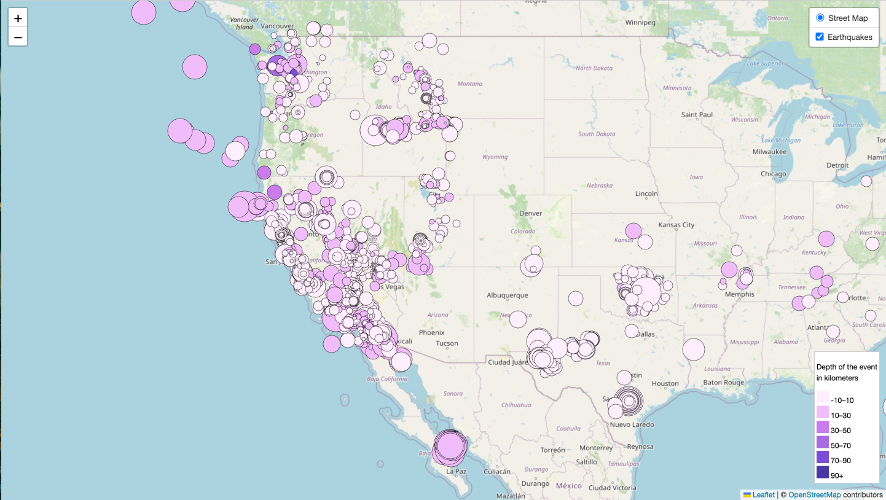

# leaflet-challenge

## Background
The United States Geological Survey, or USGS for short, is responsible for providing scientific data about natural hazards, the health of our ecosystems and environment, and the impacts of climate and land-use change. Their scientists develop new methods and tools to supply timely, relevant, and useful information about the Earth and its processes.

The USGS is interested in building a new set of tools that will allow them to visualize their earthquake data. They collect a massive amount of data from all over the world each day, but they lack a meaningful way of displaying it. In this challenge, you have been tasked with developing a way to visualize USGS data that will allow them to better educate the public and other government organizations (and hopefully secure more funding) on issues facing our planet.Include popups that provide additional information about the earthquake when its associated marker is clicked.

## Part 1: Create the Earthquake Visualization
Loaded TileLayer of [Leaflet StreetMap](https://{s}.tile.openstreetmap.org/{z}/{x}/{y}.png)
Connected to [geojson API](https://earthquake.usgs.gov/earthquakes/feed/v1.0/summary/all_month.geojson) using D3. I chose earthquake data over the last month.
The markers size correspond to the earthquake magnitude and the color corrosponds to the earthquake depth (earthquakes with greater depth appear darker).
Included popups that provide additional information about the earthquake when its associated marker is clicked.
The legend provides context for my map data.


### Technologies Used
HTML
CSS
JavaScript
D3.js (Data-Driven Documents) for data visualization

## Usage
To use this website:
```bash
git clone https://github.com/reederickson/leaflet-challenge.git
```
-Open the index.html file in your web browser to access the website.
-Interact with the map to explore the earthquake data.
-Explore the markers to understand the size, depth, location and date of each earthquake.